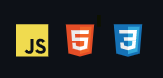

# Landing Page Projet (english)

>This project has the function of simulating a responsive web page of a technology agency. This landing page can be used as a demonstration in companies and various types of services.

<br>

<div align="center" background-color="">
    
</div>
<br>


>[Link for web page](https://felipedalbert.github.io/landing-page-project/)

<br>

## Technologies used
- JavaScript
- HTML
- CSS 


<br>

## How to use?

### 1 - Navigation menu
```
The navigation menu allows the user to jump directly to a specific area of the page.
```


---

### 2 - Image sequence
```
It is possible to change the image of the panel through the arrow button in the area of < ​​"nossos projetos". When the arrow changes color to gray it means there are no more images to display.
```


---

### 3 - screen responsiveness
```
The user will have the best experience on all devices and on different screen sizes 
```


<br>
<br>
<br>
<br>
<br>

# Projeto Landing Page (português)
<br>

>Este projeto tem a função de simular uma página web totalmente responsiva de uma agência de tecnologia. Esta landing page pode ser usada como demonstração em empresas e diversos tipos de serviços.

<br>

<div align="center" background-color="">
    
</div>
<br>


>[Link para página na web](https://felipedalbert.github.io/landing-page-project/)

<br>
<br>

## Tecnologias utilizadas
- JavaScript
- HTML
- CSS 


<br>
<br>
<br>

## Como utilizar?
<br>

### 1 - Menu de navegação
```
O menu de navegação permite ao usuário pular diretamente para uma área específica da página
```


---

### 2 - Sequência de imagens
```
É possível alterar a imagem do painel através do botão de seta na área de "nossos projetos". Quando a seta muda de cor para cinza, significa que não há mais imagens para serem exibidas
```


---

### 3 - Tela responsiva
```
O usuário terá a melhor experiência em todos os dispositivos e em diferentes tamanhos de tela
```

